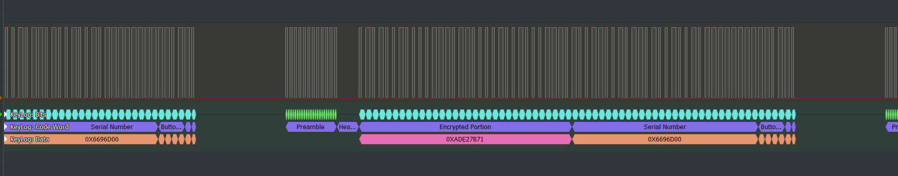
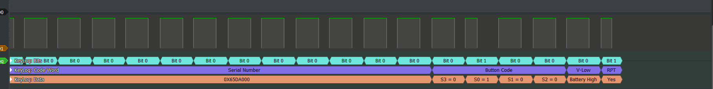

# KeeLoq decoder for PulseView
This decoder has been developed for [PulseView](https://sigrok.org/wiki/PulseView) using [Sigrok API](http://sigrok.org/wiki/Protocol_decoder_API) .
The following output has been obtained connecting a Logic Analizer to the PWM pin of an IC implementing the KeyLoq algorithm.

A Code Word

Detail

## KeeLoq in a nutshell
KeeLoq is proprietary block cypher widely used in industry as secure Remote Keyless Entry (RKE) systems.
It has been designed to be easily implemented at hardware level in Integrated Circuit for secure wireless transmissions. Typical applications for KeeLoq are remote controllers for gates, car immobilizers and anti-theft systems. Each remote control, known as an encoder, relies on the internal IC to transmit a command to the receiver using _Keeloq_ as a cryptographic algorithm. After information has been deciphered on the receiver side, it reacts to the command by opening a door or unlocking a system.
***
## Code Word Structure
KeeLoq uses PWM (_Pulse Width Modulation_) to encode logical bits. In particular the documentation 
states the TE as the _'Basic Pulse Element'_ and it is considered the minimum information visibile within a _'Code Word'_. 

Each transmission is organized in a logical structure named _'Code Word'_ described below :
### Preamble + Header
    +----------+--------+---------------+
    | Preamble | Header | Data Portion  |
    +----------+--------+---------------+
    0   TE   23 0  TE 10 0    Bits     65 

- **Preamble** = 23 TE with 50% Duty Cycle.
- **Header** = 10 TE at Low level.

### Data Portion

    Bits:
    0                 31 32           59 60               63 64          65              
    +-------------------+---------------+----+----+----+----+-------+-----+
    | Encrypted Portion | Serial Number | Button Code       |   Status    |
    +-------------------+---------------*----+----+----+----+-------+-----+
                                        | S3 | S0 | S1 | S2 | V-Low | RPT |
                                        *----+----+----+----+-------+-----+
    LSB                                                                 MSB
Please note that **LSB** is transmitted **first** . This means that Encrypted Portion is sent out <u>before any other parts</u>.

+ **Encrypted Portion** : This data changes everytime a button is pressed according to the encryption algorithm.
+ **Serial Number** : Unique value present in each encoder.
+ **Button Code** : Button pressed.
+ **V-Low** : Indicates encoder battery voltage : High/Low.
+ **RPT** : Reports if the button is kept pressed. 

***

## What this decoder does: 
- It is able to recognise a sequence of _'Code Words'_ genederated by an econder that uses KeeLoq encryption algorithm.
- It decodes the PWM signals into a human readble format for each _'Code Word'_.
- it shows data in the same format as described in the official documentation.
- It shows '_Encrypted Portion_' just as transmitted by the encoder.

## What this decoder does NOT do:
- Decrypt the '_Encrytped Portion_' 
- Extract the Master encryption key. 

## Installation 
Depending of your Operating System create a new directory named <u>keeloq</u> 

**Windows**: %LOCALAPPDATA%\libsigrokdecode\decoders\\**keeloq**

**Linux**: ~/.local/share/libsigrokdecode/decoders/**keeloq**

    $ git clone https://github.com/rzondr/KeeLoq_decoder.git
    $ cd KeeLoq_decoder
    $ cp __init__.py pd.py <the newly created directory>
   
- Run Pulseview. 
- Add decoder selecting KeeLoq.
- Click on the decoder and select the acquisition channel.
- Run signal acquisition. 
- Enjoy the reading.

Please note that it is present also a sample file named **hcs300_sample.sr** for your convenience.

## Tested Integrated circuits
At the writing time here the ICs succesfully tested with this decorder
- **HCS300** [Datasheet](https://ww1.microchip.com/downloads/aemDocuments/documents/MCU08/ProductDocuments/DataSheets/21137G.pdf)
- **HCS301** [Datasheet](https://ww1.microchip.com/downloads/en/devicedoc/21143b.pdf)

Looking forward to seeing this list longer.

### How to contribute
I aim to write a KeeLoq decoder able to recognise _'Code Words'_ generated by as much as possible encoders.
If you want to contribute to this, please send an email to : <andrea.orazi@gmail.com> as follows:
- <u>Subject</u> : KeeLoq Encoder - IC name - (ex. hcs300)
- <u>Body</u> : Whatever you think is worth adding about the IC and the application it is used for'.
- <u>Att'achment</u> : A PulseView sample containing a good number of _Code Words_ in **.sr** format.
***
# Change Log:
- Version 0.2 - [29th September 2024]
    * TEs timing review 
    * Bug-Fix regarding LSB-MSB interpretation for the Encrypted Portion and Fixed Part
    * Minor code changes
    * IC: HCS301 Succesfully tested (Contribution Tobias Rothfelder)

- Version 0.1 - [09th May 2024]: 
    * Recognise a sequence of _Code Words_ genederated by an econder and shows their content in human readble format.
    * IC: HCS300 Succesfully tested  
